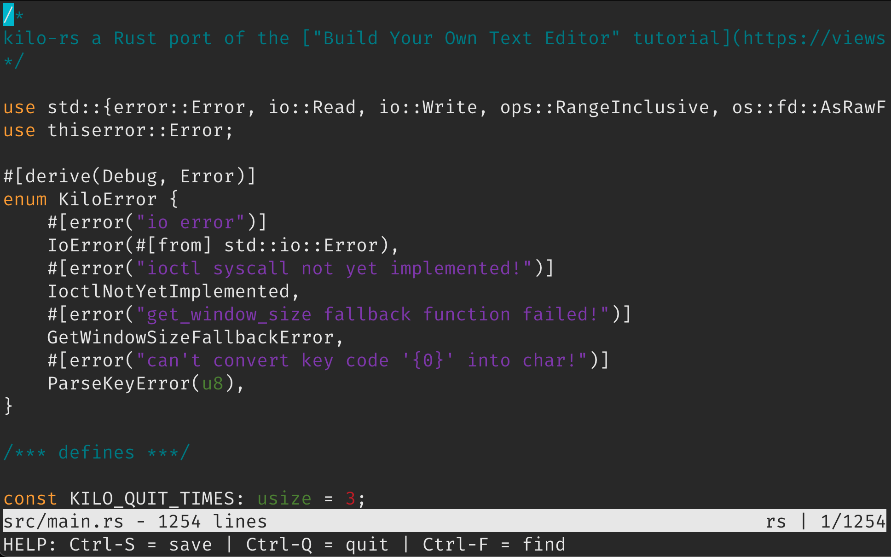

# kilo-rs - a Rust port of the ["Build Your Own Text Editor" tutorial](https://viewsourcecode.org/snaptoken/kilo/index.html)

* Web link: https://viewsourcecode.org/snaptoken/kilo/index.html
* Github page: https://github.com/snaptoken/kilo-tutorial/tree/v1.0.0beta11

From the tutorial introduction:

> Welcome! This is an instruction booklet that shows you how to build a text editor in C.
>
> The text editor is [antirez’s kilo](http://antirez.com/news/108), with some changes. It’s about 1000 lines of C in a single file with no dependencies, and it implements all the basic features you expect in a minimal editor, as well as syntax highlighting and a search feature.

This Rust port may not be very idiomatic as I adapted the C code on-the-fly as I was working through the tutorial.

All in all a very fun experience with a somewhat satisfying end result. If you're remotely interested in writing TUI applications I recommend you try the "Build Your Own Text Editor" tutorial as well. After that you'll probably have a much bigger appreciation for third-party TUI libraries that handle much of the quirky terminal input/output!

     
    <i>Screenshot of the "finished" text editor editing its own main source file with syntax highlighting.</i>

## Key learnings

* The tutorial makes heavy use of global and function-local static variables, which don't play nice with the ownership model and borrow checker in Rust. I implemented the global static state as a local variable in `main()` and passed a mutable reference with each function call to ensure "global" accessibility. I added all function-local static variables to the global state struct. This approach seems to work OK in a single-threaded context.
* Rust strings are always composed of valid unicode characters. However, when creating as String slice indexing is byte-based, not character-based. I only realized this halfway through the tutorial and couldn't be bothered to try fixing this. Thus, `kilo-rs` will crash whenever it encounteres multi-byte unicode characters in the currently edited file.
* Because of the lacking unicode handling I also completely skipped the "Nonprintable characters" section in chapter 7 "Syntax Highlighting".
